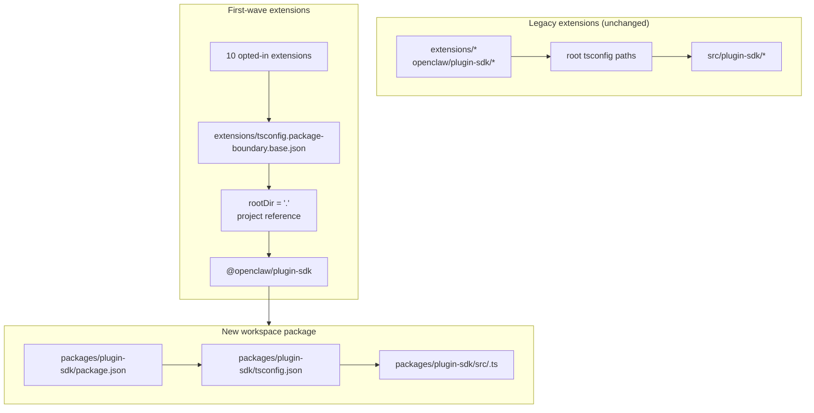

# refactor: Make plugin-sdk a real workspace package incrementally

## Overview

This plan introduces a real workspace package for the plugin SDK at
`packages/plugin-sdk` and uses it to opt in a small first wave of extensions to
compiler-enforced package boundaries. The goal is to make illegal relative
imports fail under normal `tsc` for a selected set of bundled provider
extensions, without forcing a repo-wide migration or a giant merge-conflict
surface.

The key incremental move is to run two modes in parallel for a while:

| Mode        | Import shape             | Who uses it                          | Enforcement                                  |
| ----------- | ------------------------ | ------------------------------------ | -------------------------------------------- |
| Legacy mode | `openclaw/plugin-sdk/*`  | all existing non-opted-in extensions | current permissive behavior remains          |
| Opt-in mode | `@openclaw/plugin-sdk/*` | first-wave extensions only           | package-local `rootDir` + project references |

## Problem Frame

The current repo exports a large public plugin SDK surface, but it is not a real
workspace package. Instead:

- root `tsconfig.json` maps `openclaw/plugin-sdk/*` directly to
  `src/plugin-sdk/*.ts`
- extensions that were not opted into the previous experiment still share that
  global source-alias behavior
- adding `rootDir` only works when allowed SDK imports stop resolving into raw
  repo source

That means the repo can describe the desired boundary policy, but TypeScript
does not enforce it cleanly for most extensions.

You want an incremental path that:

- makes `plugin-sdk` real
- moves the SDK toward a workspace package named `@openclaw/plugin-sdk`
- changes only about 10 extensions in the first PR
- leaves the rest of the extension tree on the old scheme until later cleanup
- avoids the `tsconfig.plugin-sdk.dts.json` + postinstall-generated declaration
  workflow as the primary mechanism for the first-wave rollout

## Requirements Trace

- R1. Create a real workspace package for the plugin SDK under `packages/`.
- R2. Name the new package `@openclaw/plugin-sdk`.
- R3. Give the new SDK package its own `package.json` and `tsconfig.json`.
- R4. Keep legacy `openclaw/plugin-sdk/*` imports working for non-opted-in
  extensions during the migration window.
- R5. Opt in only a small first wave of extensions in the first PR.
- R6. The first-wave extensions must fail closed for relative imports that leave
  their package root.
- R7. The first-wave extensions must consume the SDK through a package
  dependency and a TS project reference, not through root `paths` aliases.
- R8. The plan must avoid a repo-wide mandatory postinstall generation step for
  editor correctness.
- R9. The first-wave rollout must be reviewable and mergeable as a moderate PR,
  not a repo-wide 300+ file refactor.

## Scope Boundaries

- No full migration of all bundled extensions in the first PR.
- No requirement to delete `src/plugin-sdk` in the first PR.
- No requirement to rewire every root build or test path to use the new package
  immediately.
- No attempt to force VS Code squiggles for every non-opted-in extension.
- No broad lint cleanup for the rest of the extension tree.
- No large runtime behavior changes beyond import resolution, package ownership,
  and boundary enforcement for the opted-in extensions.

## Context & Research

### Relevant Code and Patterns

- `pnpm-workspace.yaml` already includes `packages/*` and `extensions/*`, so a
  new workspace package under `packages/plugin-sdk` fits the existing repo
  layout.
- Existing workspace packages such as `packages/memory-host-sdk/package.json`
  and `packages/plugin-package-contract/package.json` already use package-local
  `exports` maps rooted in `src/*.ts`.
- Root `package.json` currently publishes the SDK surface through `./plugin-sdk`
  and `./plugin-sdk/*` exports backed by `dist/plugin-sdk/*.js` and
  `dist/plugin-sdk/*.d.ts`.
- `src/plugin-sdk/entrypoints.ts` and `scripts/lib/plugin-sdk-entrypoints.json`
  already act as the canonical entrypoint inventory for the SDK surface.
- Root `tsconfig.json` currently maps:
  - `openclaw/plugin-sdk` -> `src/plugin-sdk/index.ts`
  - `openclaw/plugin-sdk/*` -> `src/plugin-sdk/*.ts`
- The previous boundary experiment showed that package-local `rootDir` works for
  illegal relative imports only after allowed SDK imports stop resolving to raw
  source outside the extension package.

### First-Wave Extension Set

This plan assumes the first wave is the provider-heavy set that is least likely
to drag in complex channel-runtime edge cases:

- `extensions/anthropic`
- `extensions/exa`
- `extensions/firecrawl`
- `extensions/groq`
- `extensions/mistral`
- `extensions/openai`
- `extensions/perplexity`
- `extensions/tavily`
- `extensions/together`
- `extensions/xai`

### First-Wave SDK Surface Inventory

The first-wave extensions currently import a manageable subset of SDK subpaths.
The initial `@openclaw/plugin-sdk` package only needs to cover these:

- `agent-runtime`
- `cli-runtime`
- `config-runtime`
- `core`
- `image-generation`
- `media-runtime`
- `media-understanding`
- `plugin-entry`
- `plugin-runtime`
- `provider-auth`
- `provider-auth-api-key`
- `provider-auth-login`
- `provider-auth-runtime`
- `provider-catalog-shared`
- `provider-entry`
- `provider-http`
- `provider-model-shared`
- `provider-onboard`
- `provider-stream-family`
- `provider-stream-shared`
- `provider-tools`
- `provider-usage`
- `provider-web-fetch`
- `provider-web-search`
- `realtime-transcription`
- `realtime-voice`
- `runtime-env`
- `secret-input`
- `security-runtime`
- `speech`
- `testing`

### Institutional Learnings

- No relevant `docs/solutions/` entries were present in this worktree.

### External References

- No external research was needed for this plan. The repo already contains the
  relevant workspace-package and SDK-export patterns.

## Key Technical Decisions

- Introduce `@openclaw/plugin-sdk` as a new workspace package while keeping the
  legacy root `openclaw/plugin-sdk/*` surface alive during migration.
  Rationale: this lets a first-wave extension set move onto real package
  resolution without forcing every extension and every root build path to change
  at once.

- Use a dedicated opt-in boundary base config such as
  `extensions/tsconfig.package-boundary.base.json` instead of replacing the
  existing extension base for everyone.
  Rationale: the repo needs to support both legacy and opt-in extension modes
  simultaneously during migration.

- Use TS project references from first-wave extensions to
  `packages/plugin-sdk/tsconfig.json` and set
  `disableSourceOfProjectReferenceRedirect` for the opt-in boundary mode.
  Rationale: this gives `tsc` a real package graph while discouraging editor and
  compiler fallback to raw source traversal.

- Keep `@openclaw/plugin-sdk` private in the first wave.
  Rationale: the immediate goal is internal boundary enforcement and migration
  safety, not publishing a second external SDK contract before the surface is
  stable.

- Move only the first-wave SDK subpaths in the first implementation slice, and
  keep compatibility bridges for the rest.
  Rationale: physically moving all 315 `src/plugin-sdk/*.ts` files in one PR is
  exactly the merge-conflict surface this plan is trying to avoid.

- Do not rely on `scripts/postinstall-bundled-plugins.mjs` to build SDK
  declarations for the first wave.
  Rationale: explicit build/reference flows are easier to reason about and keep
  repo behavior more predictable.

## Open Questions

### Resolved During Planning

- Which extensions should be in the first wave?
  Use the 10 provider/web-search extensions listed above because they are more
  structurally isolated than the heavier channel packages.

- Should the first PR replace the entire extension tree?
  No. The first PR should support two modes in parallel and only opt in the
  first wave.

- Should the first wave require a postinstall declaration build?
  No. The package/reference graph should be explicit, and CI should run the
  relevant package-local typecheck intentionally.

### Deferred to Implementation

- Whether the first-wave package can point directly at package-local `src/*.ts`
  via project references alone, or whether a small declaration-emission step is
  still required for the `@openclaw/plugin-sdk` package.
  This is an implementation-owned TS graph validation question.

- Whether the root `openclaw` package should proxy first-wave SDK subpaths to
  `packages/plugin-sdk` outputs immediately or continue using generated
  compatibility shims under `src/plugin-sdk`.
  This is a compatibility and build-shape detail that depends on the minimal
  implementation path that keeps CI green.

## High-Level Technical Design

> This illustrates the intended approach and is directional guidance for review, not implementation specification. The implementing agent should treat it as context, not code to reproduce.

## Implementation Units

- [ ] **Unit 1: Introduce the real `@openclaw/plugin-sdk` workspace package**

**Goal:** Create a real workspace package for the SDK that can own the
first-wave subpath surface without forcing a repo-wide migration.

**Requirements:** R1, R2, R3, R8, R9

**Dependencies:** None

**Files:**

- Create: `packages/plugin-sdk/package.json`
- Create: `packages/plugin-sdk/tsconfig.json`
- Create: `packages/plugin-sdk/src/index.ts`
- Create: `packages/plugin-sdk/src/*.ts` for the first-wave SDK subpaths
- Modify: `pnpm-workspace.yaml` only if package-glob adjustments are needed
- Modify: `package.json`
- Modify: `src/plugin-sdk/entrypoints.ts`
- Modify: `scripts/lib/plugin-sdk-entrypoints.json`
- Test: `src/plugins/contracts/plugin-sdk-workspace-package.contract.test.ts`

**Approach:**

- Add a new workspace package named `@openclaw/plugin-sdk`.
- Start with the first-wave SDK subpaths only, not the entire 315-file tree.
- If directly moving a first-wave entrypoint would create an oversized diff, the
  first PR may introduce that subpath in `packages/plugin-sdk/src` as a thin
  package wrapper first and then flip the source of truth to the package in a
  follow-up PR for that subpath cluster.
- Reuse the existing entrypoint inventory machinery so the first-wave package
  surface is declared in one canonical place.
- Keep the root package exports alive for legacy users while the workspace
  package becomes the new opt-in contract.

**Patterns to follow:**

- `packages/memory-host-sdk/package.json`
- `packages/plugin-package-contract/package.json`
- `src/plugin-sdk/entrypoints.ts`

**Test scenarios:**

- Happy path: the workspace package exports every first-wave subpath listed in
  the plan and no required first-wave export is missing.
- Edge case: package export metadata remains stable when the first-wave entry
  list is re-generated or compared against the canonical inventory.
- Integration: root package legacy SDK exports remain present after introducing
  the new workspace package.

**Verification:**

- The repo contains a valid `@openclaw/plugin-sdk` workspace package with a
  stable first-wave export map and no legacy export regression in root
  `package.json`.

- [ ] **Unit 2: Add an opt-in TS boundary mode for package-enforced extensions**

**Goal:** Define the TS configuration mode that opted-in extensions will use,
while leaving the existing extension TS behavior unchanged for everyone else.

**Requirements:** R4, R6, R7, R8, R9

**Dependencies:** Unit 1

**Files:**

- Create: `extensions/tsconfig.package-boundary.base.json`
- Create: `tsconfig.boundary-optin.json`
- Modify: `extensions/xai/tsconfig.json`
- Modify: `extensions/openai/tsconfig.json`
- Modify: `extensions/anthropic/tsconfig.json`
- Modify: `extensions/mistral/tsconfig.json`
- Modify: `extensions/groq/tsconfig.json`
- Modify: `extensions/together/tsconfig.json`
- Modify: `extensions/perplexity/tsconfig.json`
- Modify: `extensions/tavily/tsconfig.json`
- Modify: `extensions/exa/tsconfig.json`
- Modify: `extensions/firecrawl/tsconfig.json`
- Test: `src/plugins/contracts/extension-package-project-boundaries.test.ts`
- Test: `test/extension-package-tsc-boundary.test.ts`

**Approach:**

- Leave `extensions/tsconfig.base.json` in place for legacy extensions.
- Add a new opt-in base config that:
  - sets `rootDir: "."`
  - references `packages/plugin-sdk`
  - enables `composite`
  - disables project-reference source redirect when needed
- Add a dedicated solution config for the first-wave typecheck graph instead of
  reshaping the root repo TS project in the same PR.

**Execution note:** Start with a failing package-local canary typecheck for one
opted-in extension before applying the pattern to all 10.

**Patterns to follow:**

- Existing package-local extension `tsconfig.json` pattern from the prior
  boundary work
- Workspace package pattern from `packages/memory-host-sdk`

**Test scenarios:**

- Happy path: each opted-in extension typechecks successfully through the
  package-boundary TS config.
- Error path: a canary relative import from `../../src/cli/acp-cli.ts` fails
  with `TS6059` for an opted-in extension.
- Integration: non-opted-in extensions remain untouched and do not need to
  participate in the new solution config.

**Verification:**

- There is a dedicated typecheck graph for the 10 opted-in extensions, and bad
  relative imports from one of them fail through normal `tsc`.

- [ ] **Unit 3: Migrate the first-wave extensions onto `@openclaw/plugin-sdk`**

**Goal:** Change the first-wave extensions to consume the real SDK package
through dependency metadata, project references, and package-name imports.

**Requirements:** R5, R6, R7, R9

**Dependencies:** Unit 2

**Files:**

- Modify: `extensions/anthropic/package.json`
- Modify: `extensions/exa/package.json`
- Modify: `extensions/firecrawl/package.json`
- Modify: `extensions/groq/package.json`
- Modify: `extensions/mistral/package.json`
- Modify: `extensions/openai/package.json`
- Modify: `extensions/perplexity/package.json`
- Modify: `extensions/tavily/package.json`
- Modify: `extensions/together/package.json`
- Modify: `extensions/xai/package.json`
- Modify: production and test imports under each of the 10 extension roots that
  currently reference `openclaw/plugin-sdk/*`

**Approach:**

- Add `@openclaw/plugin-sdk: workspace:*` to the first-wave extension
  `devDependencies`.
- Replace `openclaw/plugin-sdk/*` imports in those packages with
  `@openclaw/plugin-sdk/*`.
- Keep local extension-internal imports on local barrels such as `./api.ts` and
  `./runtime-api.ts`.
- Do not change non-opted-in extensions in this PR.

**Patterns to follow:**

- Existing extension-local import barrels (`api.ts`, `runtime-api.ts`)
- Package dependency shape used by other `@openclaw/*` workspace packages

**Test scenarios:**

- Happy path: each migrated extension still registers/loads through its existing
  plugin tests after the import rewrite.
- Edge case: test-only SDK imports in the opted-in extension set still resolve
  correctly through the new package.
- Integration: migrated extensions do not require root `openclaw/plugin-sdk/*`
  aliases for typechecking.

**Verification:**

- The first-wave extensions build and test against `@openclaw/plugin-sdk`
  without needing the legacy root SDK alias path.

- [ ] **Unit 4: Preserve legacy compatibility while the migration is partial**

**Goal:** Keep the rest of the repo working while the SDK exists in both legacy
and new-package forms during migration.

**Requirements:** R4, R8, R9

**Dependencies:** Units 1-3

**Files:**

- Modify: `src/plugin-sdk/*.ts` for first-wave compatibility shims as needed
- Modify: `package.json`
- Modify: build or export plumbing that assembles SDK artifacts
- Test: `src/plugins/contracts/plugin-sdk-runtime-api-guardrails.test.ts`
- Test: `src/plugins/contracts/plugin-sdk-index.bundle.test.ts`

**Approach:**

- Keep root `openclaw/plugin-sdk/*` as the compatibility surface for legacy
  extensions and for external consumers that are not moving yet.
- Use either generated shims or root-export proxy wiring for the first-wave
  subpaths that have moved into `packages/plugin-sdk`.
- Do not attempt to retire the root SDK surface in this phase.

**Patterns to follow:**

- Existing root SDK export generation via `src/plugin-sdk/entrypoints.ts`
- Existing package export compatibility in root `package.json`

**Test scenarios:**

- Happy path: a legacy root SDK import still resolves for a non-opted-in
  extension after the new package exists.
- Edge case: a first-wave subpath works through both the legacy root surface and
  the new package surface during the migration window.
- Integration: plugin-sdk index/bundle contract tests continue to see a coherent
  public surface.

**Verification:**

- The repo supports both legacy and opt-in SDK consumption modes without
  breaking unchanged extensions.

- [ ] **Unit 5: Add scoped enforcement and document the migration contract**

**Goal:** Land CI and contributor guidance that enforce the new behavior for the
first wave without pretending the entire extension tree is migrated.

**Requirements:** R5, R6, R8, R9

**Dependencies:** Units 1-4

**Files:**

- Modify: `package.json`
- Modify: CI workflow files that should run the opt-in boundary typecheck
- Modify: `AGENTS.md`
- Modify: `docs/plugins/sdk-overview.md`
- Modify: `docs/plugins/sdk-entrypoints.md`
- Modify: `docs/plans/2026-04-05-001-refactor-extension-package-resolution-boundary-plan.md`

**Approach:**

- Add an explicit first-wave gate, such as a dedicated `tsc -b` solution run for
  `packages/plugin-sdk` plus the 10 opted-in extensions.
- Document that the repo now supports both legacy and opt-in extension modes,
  and that new extension boundary work should prefer the new package route.
- Record the next-wave migration rule so later PRs can add more extensions
  without re-litigating the architecture.

**Patterns to follow:**

- Existing contract tests under `src/plugins/contracts/`
- Existing docs updates that explain staged migrations

**Test scenarios:**

- Happy path: the new first-wave typecheck gate passes for the workspace package
  and the opted-in extensions.
- Error path: introducing a new illegal relative import in an opted-in
  extension fails the scoped typecheck gate.
- Integration: CI does not require non-opted-in extensions to satisfy the new
  package-boundary mode yet.

**Verification:**

- The first-wave enforcement path is documented, tested, and runnable without
  forcing the entire extension tree to migrate.

## System-Wide Impact

- **Interaction graph:** this work touches the SDK source-of-truth, root package
  exports, extension package metadata, TS graph layout, and CI verification.
- **Error propagation:** the main intended failure mode becomes compile-time TS
  errors (`TS6059`) in opted-in extensions instead of custom script-only
  failures.
- **State lifecycle risks:** dual-surface migration introduces drift risk between
  root compatibility exports and the new workspace package.
- **API surface parity:** first-wave subpaths must remain semantically identical
  through both `openclaw/plugin-sdk/*` and `@openclaw/plugin-sdk/*` during the
  transition.
- **Integration coverage:** unit tests are not enough; scoped package-graph
  typechecks are required to prove the boundary.
- **Unchanged invariants:** non-opted-in extensions keep their current behavior
  in PR 1. This plan does not claim repo-wide import-boundary enforcement.

## Risks & Dependencies

| Risk                                                                                                   | Mitigation                                                                                                              |
| ------------------------------------------------------------------------------------------------------ | ----------------------------------------------------------------------------------------------------------------------- |
| The first-wave package still resolves back into raw source and `rootDir` does not actually fail closed | Make the first implementation step a package-reference canary on one opted-in extension before widening to the full set |
| Moving too much SDK source at once recreates the original merge-conflict problem                       | Move only the first-wave subpaths in the first PR and keep root compatibility bridges                                   |
| Legacy and new SDK surfaces drift semantically                                                         | Keep a single entrypoint inventory, add compatibility contract tests, and make dual-surface parity explicit             |
| Root repo build/test paths accidentally start depending on the new package in uncontrolled ways        | Use a dedicated opt-in solution config and keep root-wide TS topology changes out of the first PR                       |

## Phased Delivery

### Phase 1

- Introduce `@openclaw/plugin-sdk`
- Define the first-wave subpath surface
- Prove one opted-in extension can fail closed through `rootDir`

### Phase 2

- Opt in the 10 first-wave extensions
- Keep root compatibility alive for everyone else

### Phase 3

- Add more extensions in later PRs
- Move more SDK subpaths into the workspace package
- Retire root compatibility only after the legacy extension set is gone

## Documentation / Operational Notes

- The first PR should explicitly describe itself as a dual-mode migration, not a
  repo-wide enforcement completion.
- The migration guide should make it easy for later PRs to add more extensions
  by following the same package/dependency/reference pattern.

## Sources & References

- Prior plan: `docs/plans/2026-04-05-001-refactor-extension-package-resolution-boundary-plan.md`
- Workspace config: `pnpm-workspace.yaml`
- Existing SDK entrypoint inventory: `src/plugin-sdk/entrypoints.ts`
- Existing root SDK exports: `package.json`
- Existing workspace package patterns:
  - `packages/memory-host-sdk/package.json`
  - `packages/plugin-package-contract/package.json`
